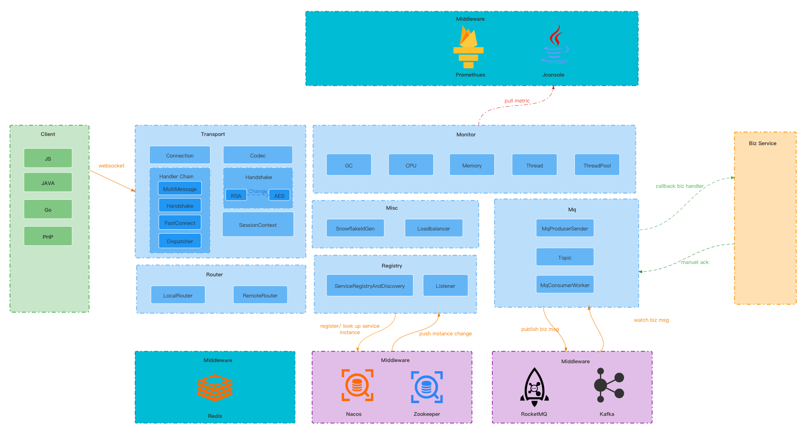

# piccolo
[](https://www.apache.org/licenses/LICENSE-2.0.html)
[](https://travis-ci.org/zhuangjinjin/piccolo)

## 简介

piccolo是一个长连接网关服务器。

## 架构图

 

## 技术

项目主要是基于Netty4.x开发的。

* Jdk 8+
* Netty 4.1.25
* ZooKeeper 3.5.5
* Kafka 2.0.0
* Nacos 1.1.3
* Redis
* Prometheus
* Apache Commons
* Guava
* Fastjson
* Protobuf

## 模块说明

| 模块名称             | 用途                                                         |
| -------------------- | ------------------------------------------------------------ |
| piccolo-api          | API接口模块（包含缓存，配置，传输，负载均衡，消息队列，路由，插件等抽象接口） |
| piccolo-cache        | 缓存模块（目前仅支持redis缓存）                              |
| piccolo-client       | 客户端模块（供网关服务器的下游业务系统调用）                 |
| piccolo-commons      | 通用组件模块（包含事件总线，负载均衡实现，自定义消息，安全，线程池） |
| piccolo-config       | 配置模块（配置松散绑定）                                     |
| piccolo-configcenter | 配置中心 (目前仅支持Nacos)                                   |
| piccolo-core         | 服务端核心处理模块                                           |
| piccolo-distribution | 发布模块                                                     |
| piccolo-monitor      | 监控模块（基于JMX，监控系统CPU负载，系统内存，JVM内存，线程池，JVM GC等） |
| piccolo-mq           | 消息模块（目前仅支持Kafka）                                  |
| piccolo-registry     | 服务注册/发现模块（目前仅支持Nacos，ZooKeeper）              |
| piccolo-server       | 服务端模块                                                   |
| piccolo-transport    | 传输模块（基于Netty 4开发，可配置粗粒度的流控，自定义流式解析） |

## 使用

### Server端

**Step1: GitHub下载源代码并编译**

```shell
git clone https://github.com/zhuangjinjin/piccolo.git
```

**Step2: 构建项目**

```shell
cd piccolo
mvn clean install -Dmaven.test.skip=true -P release-server
export PICCOLO_HOME=${piccolo_path}/piccolo-distribution/target/piccolo/piccolo
```

**Step3: 修改配置文件**

复制`$PICCOLO_HOME/conf/piccolo-server.properties.example`并重新命名为`piccolo-server.properties`，修改配置如下：

```shell
piccolo.redis.host=${redis.host}
piccolo.zookeeper.host=${zookeeper.host}
piccolo.kafka.producer.bootstrap-servers=${kafka.bootstrap-servers}
piccolo.kafka.consumer.bootstrap-servers=${kafka.bootstrap-servers}
piccolo.kafka.admin-client.bootstrap-servers=${kafka.bootstrap-servers}
piccolo.nacos.server-address=${nacos.server-addr}
piccolo.nacos.endpoint=${nacos.endpoint}
```

**Step4: 启动网关服务器**

```shell
cd $PICCOLO_HOME
sh bin/startup.sh -m standalone
```

运行成功后会出现piccolo的LOGO

### Client端

**Step1:GitHub下载源代码并编译**

```shell
git clone https://github.com/zhuangjinjin/piccolo.git
```

**Step2: 构建项目**

```shell
cd piccolo
mvn clean install -Dmaven.test.skip=true
```

**Step3: 在项目pom.xml引入依赖**

```xml
<dependency>
  <groupId>io.github.ukuz</groupId>
  <artifactId>piccolo-client</artifactId>
  <version>0.1.0</version>
</dependency>
```

#### 注册消息路由

```java
RouteLocatorBuilder.routes()
  .route("/foo1", "bar")
  .route("/foo2", "bar");
```

#### 注册消息回调

```java
PushClient pushClient = new PushClient();
pushClient.registerHandler("bar", (dispatchMessage) -> {
  //todo some logic process
  ...
  //manual ack mode
  dispatchMessage.completeConsume();
});
```

#### 消息回发

```java
PushClient pushClient = new PushClient();
PushContext ret = PushContext.builder().userId("user-0").context("msg".getBytes()).build();
pushClient.push(ret);
```

#### 消息广播

```java
PushClient pushClient = new PushClient();
PushContext ret = PushContext.builder().context("msg".getBytes()).build();
pushClient.push(ret);
```

#### 分布式ID

```java
IdGen idGen = new IdGenBuilder().build();
long xid = idGen.genXid();
```


## 配置

### 服务端配置

在服务端`conf`目录下新建一个`piccolo-server.properties`，配置可分如下几类：

#### 网络配置

| 属性名                                                 | 描述                                                         |
| ------------------------------------------------------ | ------------------------------------------------------------ |
| piccolo.net.ws-path                                    | WebSocket的根路径                                            |
| piccolo.net.connect-server.bind-port                   | ConnectServer的端口                                          |
| piccolo.net.connect-server.register-ip                 | ConnectServer的IP(可选填)                                    |
| piccolo.net.connect-server.snd-buf                     | ConnectServer套接字的发送缓存区的大小(默认32K)               |
| piccolo.net.connect-server.rcv-buf                     | ConnectServer套接字的接收缓存区的大小(默认32K)               |
| piccolo.net.connect-server.write-water-mark-low        | ConnectServer的写低水位(默认128K)                            |
| piccolo.net.connect-server.write-water-mark-high       | ConnectServer的写高水位(默认256K)                            |
| piccolo.net.connect-server-traffic.enabled             | ConnectServer的流控开关(默认开启)                            |
| piccolo.net.connect-server-traffic.check-interval-ms   | ConnectServer流控的检测间隔时间(默认1000ms)                  |
| piccolo.net.connect-server-traffic.write-global-limit  | ConnectServer所有连接的在检测间隔时间内写的流量上限(单位Byte) |
| piccolo.net.connect-server-traffic.read-global-limit   | ConnectServer所有连接的在检测间隔时间内读的流量上限(单位Byte) |
| piccolo.net.connect-server-traffic.write-channel-limit | ConnectServer单个连接的在检测间隔时间内写的流量上限(单位Byte) |
| piccolo.net.connect-server-traffic.read-channel-limit  | ConnectServer单个连接的在检测间隔时间内读的流量上限(单位Byte) |
| piccolo.net.ws-server.bind-port                        |                                                              |
| piccolo.net.ws-server.register-ip                      |                                                              |
| piccolo.net.ws-server.snd-buf                          |                                                              |
| piccolo.net.ws-server.rcv-buf                          |                                                              |
| piccolo.net.ws-server.write-water-mark-low             |                                                              |
| piccolo.net.ws-server.write-water-mark-high            |                                                              |
| piccolo.net.gateway-server.bind-port                   |                                                              |
| piccolo.net.gateway-server.register-ip                 |                                                              |
| piccolo.net.gateway-server.snd-buf                     |                                                              |
| piccolo.net.gateway-server.rcv-buf                     |                                                              |
| piccolo.net.gateway-server.write-water-mark-low        |                                                              |
| piccolo.net.gateway-server.write-water-mark-high       |                                                              |
| piccolo.net.gateway-server-traffic.enabled             |                                                              |
| piccolo.net.gateway-server-traffic.check-interval-ms   |                                                              |
| piccolo.net.gateway-server-traffic.write-global-limit  |                                                              |
| piccolo.net.gateway-server-traffic.read-global-limit   |                                                              |
| piccolo.net.gateway-server-traffic.write-channel-limit |                                                              |
| piccolo.net.gateway-server-traffic.read-channel-limit  |                                                              |


#### 核心配置

| 属性名                           | 描述                                    |
| -------------------------------- | --------------------------------------- |
| piccolo.core.epoll-provider      | 填netty表示使用epoll， 填nio表示使用nio |
| piccolo.core.max-heartbeat-time  |                                         |
| piccolo.core.min-heartbeat-time  |                                         |
| piccolo.core.max-hb-timeout-ms   |                                         |
| piccolo.core.max-packet-size     |                                         |
| piccolo.core.session-expire-time |                                         |


#### 线程配置

| 属性名                                   | 描述 |
| ---------------------------------------- | ---- |
| piccolo.thread.connect-worker-thread-num |      |
| piccolo.thread.gateway-worker-thread-num |      |
| piccolo.thread.ws-worker-thread-num      |      |


#### 线程池配置

| 属性名                                           | 描述 |
| ------------------------------------------------ | ---- |
| piccolo.thread-pool.event-bus.core-size          |      |
| piccolo.thread-pool.event-bus.max-size           |      |
| piccolo.thread-pool.event-bus.queue-size         |      |
| piccolo.thread-pool.event-bus.keep-alive-seconds |      |
| piccolo.thread-pool.mq.core-size                 |      |
| piccolo.thread-pool.mq.max-size                  |      |
| piccolo.thread-pool.mq.queue-size                |      |
| piccolo.thread-pool.mq.keep-alive-seconds        |      |
| piccolo.thread-pool.id-gen.core-size             |      |
| piccolo.thread-pool.id-gen.max-size              |      |
| piccolo.thread-pool.id-gen.queue-size            |      |
| piccolo.thread-pool.id-gen.keep-alive-seconds    |      |


#### Redis配置

| 属性名                                                      | 描述 |
| ----------------------------------------------------------- | ---- |
| piccolo.redis.host                                          |      |
| piccolo.redis.mode                                          |      |
| piccolo.redis.database                                      |      |
| piccolo.redis.sentinel-master                               |      |
| piccolo.redis.password                                      |      |
| piccolo.redis.pool-config.test-while-idle                   |      |
| piccolo.redis.pool-config.test-on-borrow                    |      |
| piccolo.redis.pool-config.min-evictable-idle-time-millis    |      |
| piccolo.redis.pool-config.time-between-eviction-runs-millis |      |
| piccolo.redis.pool-config.num-tests-per-eviction-run        |      |


#### ZooKeeper配置

| 属性名                                  | 描述 |
| --------------------------------------- | ---- |
| piccolo.zookeeper.host                  |      |
| piccolo.zookeeper.ns                    |      |
| piccolo.zookeeper.session-timeout-ms    |      |
| piccolo.zookeeper.connection-timeout-ms |      |
| piccolo.zookeeper.digest                |      |
| piccolo.zookeeper.max-retries           |      |
| piccolo.zookeeper.base-sleep-time-ms    |      |
| piccolo.zookeeper.max-sleep-ms          |      |


#### Kafka配置

| 属性名                                                       | 描述 |
| ------------------------------------------------------------ | ---- |
| piccolo.kafka.producer.bootstrap-servers                     |      |
| piccolo.kafka.producer.linger-ms                             |      |
| piccolo.kafka.producer.batch-size                            |      |
| piccolo.kafka.producer.compress-type                         |      |
| piccolo.kafka.producer.max-in-flight-requests-per-connection |      |
| piccolo.kafka.producer.acks                                  |      |
| piccolo.kafka.producer.retries                               |      |
| piccolo.kafka.producer.retries-backoff-ms                    |      |
| piccolo.kafka.producer.request-timeout-ms                    |      |
| piccolo.kafka.consumer.bootstrap-servers                     |      |
| piccolo.kafka.consumer.group-id                              |      |
| piccolo.kafka.consumer.auto-offset-reset                     |      |
| piccolo.kafka.consumer.session-timeout                       |      |
| piccolo.kafka.consumer.max-poll-interval-ms                  |      |
| piccolo.kafka.consumer.enable-auto-commit                    |      |
| piccolo.kafka.consumer.auto-commit-interval-ms               |      |
| piccolo.kafka.consumer.fetch-max-bytes                       |      |
| piccolo.kafka.consumer.max-poll-records                      |      |
| piccolo.kafka.consumer.heartbeat-interval-ms                 |      |
| piccolo.kafka.consumer.connections-interval-ms               |      |
| piccolo.kafka.admin-client.bootstrap-servers                 |      |


#### Nacos配置

| 属性名                       | 描述 |
| ---------------------------- | ---- |
| piccolo.nacos.server-address |      |
| piccolo.nacos.endpoint       |      |
| piccolo.nacos.namespace      |      |
| piccolo.nacos.access-key     |      |
| piccolo.nacos.secret-key     |      |


#### 消息队列配置

| 属性名                                       | 描述 |
| -------------------------------------------- | ---- |
| piccolo.mq-topic.dispatch.num-partitions     |      |
| piccolo.mq-topic.dispatch.replication-factor |      |
| piccolo.mq-topic.online.num-partitions       |      |
| piccolo.mq-topic.online.replication-factor   |      |
| piccolo.mq-topic.offline.num-partitions      |      |
| piccolo.mq-topic.offline.replication-factor  |      |


#### 下游业务系统消息队列配置

| 属性名                                        | 描述 |
| --------------------------------------------- | ---- |
| piccolo.mq-topic.routes[0].topic              |      |
| piccolo.mq-topic.routes[0].num-partitions     |      |
| piccolo.mq-topic.routes[0].replication-factor |      |


#### 安全配置

| 属性名                       | 描述 |
| ---------------------------- | ---- |
| piccolo.security.public-key  |      |
| piccolo.security.private-key |      |


### 客户端配置

